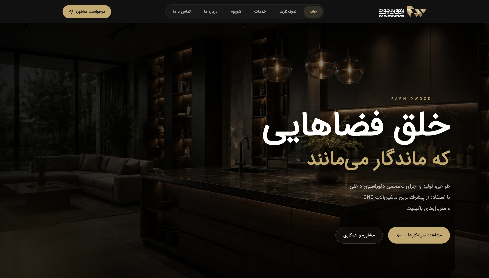
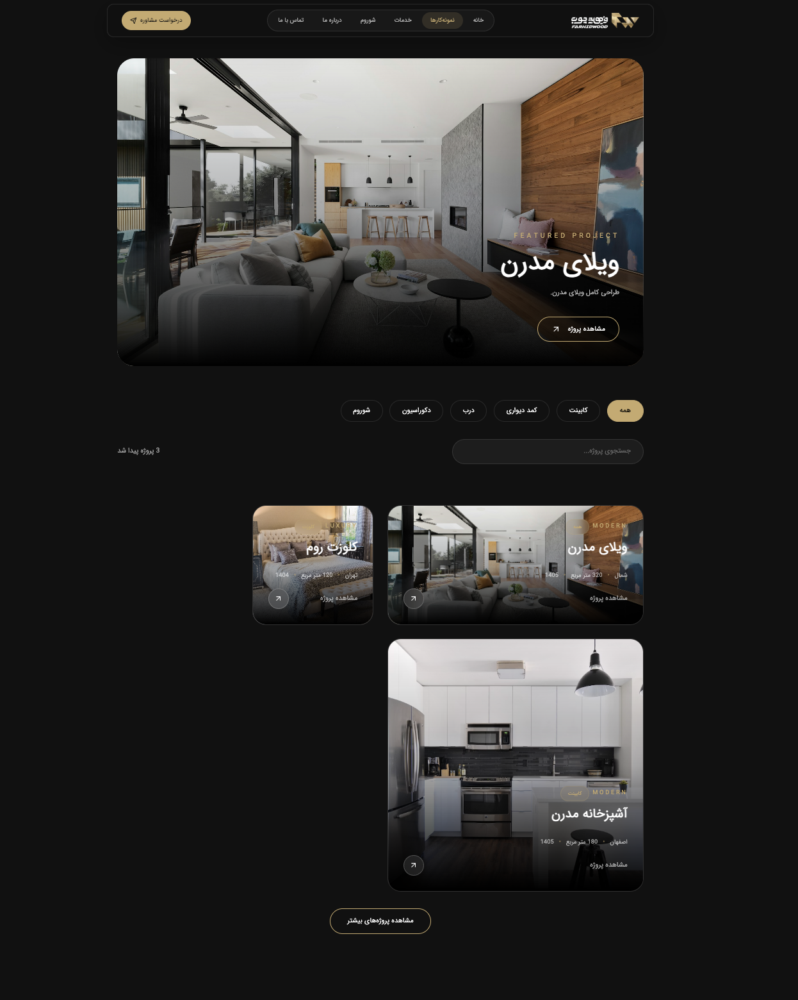
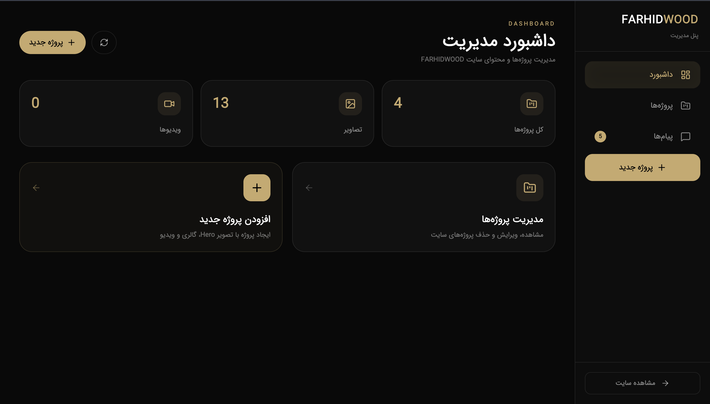
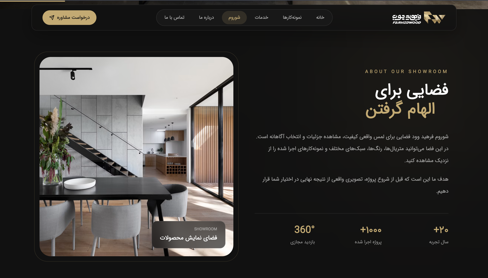

# FARHIDWOOD

### Modern Interior Design & Woodwork Showroom

A modern, elegant, and responsive full-stack showroom website designed for **FARHIDWOOD**, a brand focused on interior design, MDF, woodwork, CNC cutting, custom cabinetry, wardrobes, doors, and professional finishing.

The project combines a premium visual experience with a functional backend and administration system.

---

## 📸 Website Preview

### Homepage



### Portfolio



### Project Details


### Admin Dashboard



### Showroom




## ✨ Overview

FARHIDWOOD is a showcase website built to present interior design and woodwork projects through a clean and immersive interface.

The main goal of the project was to create a website that:

* Presents the brand professionally
* Builds trust through project showcases
* Displays completed interior design projects
* Provides detailed project pages and galleries
* Introduces materials and services
* Provides a contact system for potential clients
* Includes an administration panel for content management
* Provides authentication and protected admin routes
* Delivers smooth animations and interactive experiences
* Works across desktop, tablet, and mobile devices

---

## 🚀 Features

### Frontend

* Modern responsive UI
* Persian / RTL interface
* Custom typography
* Responsive navigation
* Animated page transitions
* Smooth scrolling
* Scroll-based animations
* Parallax background effects
* Animated statistics
* Portfolio filtering
* Project cards
* Project detail pages
* Image galleries
* Gallery modal
* Fullscreen image viewing
* Before / After presentation
* Services showcase
* Materials showcase
* Testimonials section
* Contact form
* Showroom presentation
* 360° showroom section
* Custom loading screen
* Scroll progress indicator
* 404 page

### Portfolio System

The portfolio section allows visitors to:

* Browse completed projects
* Filter projects by category
* Open individual projects
* View project information
* Explore project image galleries
* Navigate between gallery images
* View related projects

### Admin Panel

The project also includes an administration system with:

* Admin authentication
* Protected routes
* Dashboard
* Project management
* Add project
* Edit project
* Project listing
* Message management
* Image upload functionality
* Admin statistics

### Backend

The backend provides:

* REST API
* Authentication
* JWT-based authorization
* Project management APIs
* Message APIs
* Image upload handling
* Request validation
* Rate limiting
* OTP utilities
* MongoDB integration
* SMS service integration
* Eitaa service integration

---

## 🛠️ Tech Stack

### Frontend

| Technology        | Purpose                             |
| ----------------- | ----------------------------------- |
| React             | UI development                      |
| Vite              | Development & production build tool |
| React Router      | Client-side routing                 |
| Tailwind CSS      | UI styling                          |
| CSS Modules       | Component-level styling             |
| GSAP              | Advanced animations                 |
| ScrollTrigger     | Scroll-based animations             |
| JavaScript (ES6+) | Application logic                   |

### Backend

| Technology | Purpose         |
| ---------- | --------------- |
| Node.js    | Backend runtime |
| Express.js | REST API        |
| MongoDB    | Database        |
| Mongoose   | MongoDB ODM     |
| JWT        | Authentication  |
| Multer     | File uploads    |

---

## 📁 Project Structure

```text
my-app/
│
├── public/
│
├── src/
│   ├── assets/
│   │   ├── fonts/
│   │   └── picture/
│   │
│   ├── components/
│   │   ├── Home/
│   │   ├── about/
│   │   ├── admin/
│   │   ├── auth/
│   │   ├── common/
│   │   ├── contact/
│   │   ├── portfolio/
│   │   ├── services/
│   │   ├── showroom/
│   │   └── ...
│   │
│   ├── config/
│   ├── constants/
│   ├── data/
│   ├── page/
│   │   ├── admin/
│   │   └── ProjectDetails/
│   │
│   ├── sections/
│   ├── App.jsx
│   ├── App.css
│   ├── index.css
│   └── main.jsx
│
├── server/
│   ├── config/
│   ├── controllers/
│   ├── middleware/
│   ├── models/
│   ├── routes/
│   ├── schemas/
│   ├── services/
│   ├── utils/
│   ├── uploads/
│   └── server.js
│
├── .env.example
├── .gitignore
├── DEPLOY.md
├── package.json
├── tailwind.config.js
├── vite.config.js
└── README.md
```

---

## 🔐 Environment Variables

Environment variables are intentionally excluded from the repository.

Create the frontend environment file:

```bash
cp .env.example .env
```

Then configure the API URL:

```env
VITE_API_URL=http://localhost:5000/api
```

For the backend, create:

```text
server/.env
```

using:

```text
server/.env.example
```

The backend environment file contains configuration for services such as:

* MongoDB
* JWT authentication
* SMS service
* Other server-side configuration

> **Never commit `.env` files or production secrets to GitHub.**

---

## ⚙️ Installation

### 1. Clone the repository

```bash
git clone https://github.com/MohammadEsm82/farhidwood.git
```

```bash
cd farhidwood
```

### 2. Install frontend dependencies

```bash
npm install
```

### 3. Configure frontend environment

```bash
cp .env.example .env
```

Update the environment variables if necessary.

### 4. Install backend dependencies

```bash
cd server
npm install
```

Create:

```text
server/.env
```

based on:

```text
server/.env.example
```

---

## ▶️ Running the Project

### Start Frontend

From the project root:

```bash
npm run dev
```

The frontend will normally be available at:

```text
http://localhost:5173
```

### Start Backend

Open another terminal:

```bash
cd server
npm run dev
```

The backend runs on:

```text
http://localhost:5000
```

---

## 🏗️ Production Build

To create a production build:

```bash
npm run build
```

The production files will be generated inside:

```text
dist/
```

The current production build completes successfully with Vite.

> Vite currently reports a bundle-size warning for a JavaScript chunk larger than 500 KB. The application still builds successfully. Further optimization can be done through code splitting and dynamic imports.

---

## 🎨 Design Approach

The visual direction of FARHIDWOOD is based on a premium showroom aesthetic.

The interface focuses on:

* Elegant typography
* Large visual sections
* High-quality project imagery
* Minimal and clean layouts
* Smooth transitions
* Scroll-driven storytelling
* Strong visual hierarchy
* Responsive layouts
* Professional presentation of completed projects

The design was created to make the website feel closer to a premium interior design showroom rather than a conventional business website.

---

## 📱 Responsive Design

The website is designed to provide a consistent experience across:

* Desktop
* Laptop
* Tablet
* Mobile

Layouts, typography, navigation, galleries, cards, and interactive elements adapt to different screen sizes.

---

## 🔒 Security

The project includes several backend security mechanisms:

* JWT authentication
* Protected admin routes
* Environment-based secrets
* Request validation
* Rate limiting
* Server-side authentication middleware
* Separation of frontend and backend configuration

Sensitive environment files are excluded using `.gitignore`.

---

## 📊 Build Status

Frontend production build:

```text
✓ Vite production build successful
✓ 1886 modules transformed
✓ Production assets generated
```

---

## 🗺️ Future Improvements

Potential future improvements include:

* Advanced image optimization
* Lazy loading for large media assets
* Further JavaScript code splitting
* Performance optimization
* SEO improvements
* Advanced project search
* Improved admin analytics
* Cloud image storage
* Production deployment
* Automated CI/CD pipeline
* Automated testing

---

## 📄 Deployment

Deployment-related configuration and instructions are available in:

```text
DEPLOY.md
```

The repository also includes an example Nginx configuration:

```text
nginx.conf.example
```

---

## 👨‍💻 Developer

**Mohammad Esmaeili**

Frontend / Full-Stack Developer

Focused on building modern web applications with:

```text
React
JavaScript
Tailwind CSS
GSAP
Node.js
Express
MongoDB
```

---

## 📌 Project Status

**Completed — Portfolio Project**

This project was developed as a full-stack showcase website for a fictional/presentation implementation of the FARHIDWOOD interior design and woodwork brand.

---

## ⭐ If you like this project

Feel free to explore the source code and follow the repository for future updates.

---
---

# 🇮🇷 توضیحات فارسی

## معرفی پروژه

**FARHIDWOOD** یک وب‌سایت مدرن و ریسپانسیو برای معرفی یک مجموعه فعال در زمینه طراحی داخلی، دکوراسیون، MDF، چوب، CNC و اجرای پروژه‌های سفارشی است.

هدف اصلی پروژه، ایجاد یک تجربه کاربری لوکس و حرفه‌ای برای معرفی برند، نمایش نمونه‌کارها و ایجاد مسیر ارتباطی با مشتریان بوده است.

این پروژه به صورت **Full-Stack** توسعه داده شده و شامل یک رابط کاربری مدرن در سمت Frontend و یک Backend اختصاصی برای مدیریت اطلاعات و محتوای سایت است.

---

## ✨ امکانات پروژه

### بخش کاربری

* طراحی کاملاً Responsive
* رابط کاربری فارسی و RTL
* صفحه اصلی با طراحی مدرن
* انیمیشن‌های تعاملی
* افکت Parallax
* Smooth Scrolling
* Page Transition
* Loading Screen اختصاصی
* Scroll Progress
* نمایش خدمات
* معرفی متریال‌ها
* نمایش پروژه‌ها و نمونه‌کارها
* فیلتر پروژه‌ها
* صفحه جزئیات هر پروژه
* گالری تصاویر
* نمایش Before / After
* بخش Testimonials
* فرم تماس
* معرفی Showroom
* بخش نمایش 360 درجه
* صفحه 404

---

## 🖼️ سیستم نمونه‌کارها

یکی از بخش‌های اصلی پروژه، سیستم Portfolio است.

کاربر می‌تواند:

* پروژه‌های انجام‌شده را مشاهده کند
* پروژه‌ها را بر اساس دسته‌بندی فیلتر کند
* وارد صفحه جزئیات پروژه شود
* اطلاعات پروژه را مشاهده کند
* تصاویر پروژه را در Gallery مشاهده کند
* تصاویر را به صورت Fullscreen مشاهده کند
* بین تصاویر جابه‌جا شود
* پروژه‌های مرتبط را مشاهده کند

---

## 🔐 پنل مدیریت

برای مدیریت محتوای سایت یک پنل مدیریت نیز پیاده‌سازی شده است.

امکانات پنل مدیریت شامل:

* ورود مدیر
* احراز هویت با JWT
* Protected Routes
* Dashboard
* مدیریت پروژه‌ها
* افزودن پروژه
* ویرایش پروژه
* مدیریت پیام‌ها
* آپلود تصاویر
* نمایش آمار مدیریتی

---

## ⚙️ Backend

Backend پروژه با **Node.js و Express.js** توسعه داده شده و با MongoDB ارتباط دارد.

بخش Backend شامل:

* REST API
* Authentication
* JWT Authorization
* مدیریت پروژه‌ها
* مدیریت پیام‌ها
* آپلود فایل
* Validation
* Rate Limiting
* OTP Utility
* اتصال به MongoDB
* سرویس SMS
* سرویس Eitaa

---

## 🛠️ تکنولوژی‌های استفاده‌شده

### Frontend

* React
* Vite
* JavaScript
* React Router
* Tailwind CSS
* CSS Modules
* GSAP
* ScrollTrigger

### Backend

* Node.js
* Express.js
* MongoDB
* Mongoose
* JWT
* Multer

---

## 🎨 طراحی و تجربه کاربری

تمرکز اصلی طراحی روی ایجاد حس یک **Showroom لوکس و مدرن** بوده است.

در طراحی رابط کاربری از موارد زیر استفاده شده:

* Typography اختصاصی
* تصاویر بزرگ و باکیفیت
* Layoutهای مدرن
* فضای بصری مینیمال
* انیمیشن‌های Smooth
* Parallax
* Scroll-based Animation
* سلسله‌مراتب بصری مناسب
* طراحی Responsive

هدف این بوده که سایت صرفاً یک وب‌سایت شرکتی معمولی نباشد و تجربه‌ای نزدیک به یک **نمایشگاه دکوراسیون و طراحی داخلی دیجیتال** ایجاد کند.

---

## 📱 طراحی Responsive

تمام بخش‌های اصلی سایت برای نمایش در اندازه‌های مختلف صفحه طراحی شده‌اند:

* Desktop
* Laptop
* Tablet
* Mobile

Navigation، Cards، Gallery، Typography و Layoutها متناسب با اندازه صفحه تغییر می‌کنند.

---

## 🔒 امنیت

برای Backend پروژه چند لایه امنیتی در نظر گرفته شده است:

* JWT Authentication
* Protected Admin Routes
* Environment Variables
* Request Validation
* Rate Limiting
* Authentication Middleware
* جداسازی تنظیمات Frontend و Backend

اطلاعات حساس مانند Database URI، JWT Secret و API Keyها داخل Repository قرار نگرفته‌اند.

---

## 🏗️ اجرای پروژه

برای دریافت پروژه:

```bash
git clone https://github.com/MohammadEsm82/farhidwood.git
cd farhidwood
```

نصب وابستگی‌های Frontend:

```bash
npm install
```

اجرای Frontend:

```bash
npm run dev
```

برای Backend:

```bash
cd server
npm install
npm run dev
```

---

## 🏭 Build پروژه

برای ایجاد نسخه Production:

```bash
npm run build
```

Build پروژه با موفقیت توسط Vite انجام می‌شود و خروجی داخل پوشه زیر قرار می‌گیرد:

```text
dist/
```

---

## 🚀 وضعیت پروژه

**تکمیل‌شده — پروژه رزومه‌ای Full-Stack**

این پروژه با هدف نمایش توانایی‌های طراحی و توسعه یک وب‌سایت واقعی برای حوزه دکوراسیون و طراحی داخلی توسعه داده شده است.

---

## 👨‍💻 توسعه‌دهنده

**Mohammad Esmaeili**

Frontend / Full-Stack Developer

تکنولوژی‌های اصلی:

```text
React
JavaScript
Tailwind CSS
GSAP
Node.js
Express
MongoDB
```

---

## ⭐ درباره پروژه

FARHIDWOOD نمونه‌ای از توانایی من در طراحی و توسعه یک پروژه Full-Stack از مرحله طراحی رابط کاربری تا پیاده‌سازی Frontend، Backend، Authentication، مدیریت پروژه‌ها و آماده‌سازی برای Production است.

---
